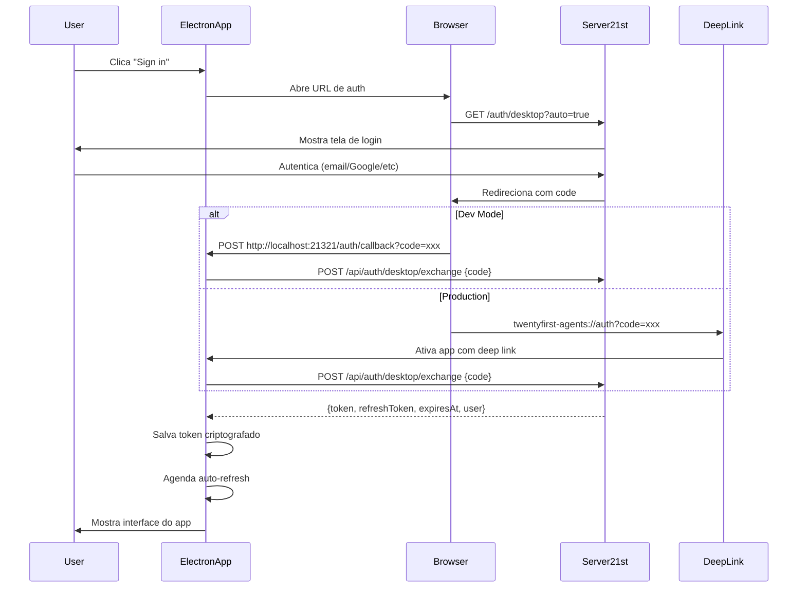
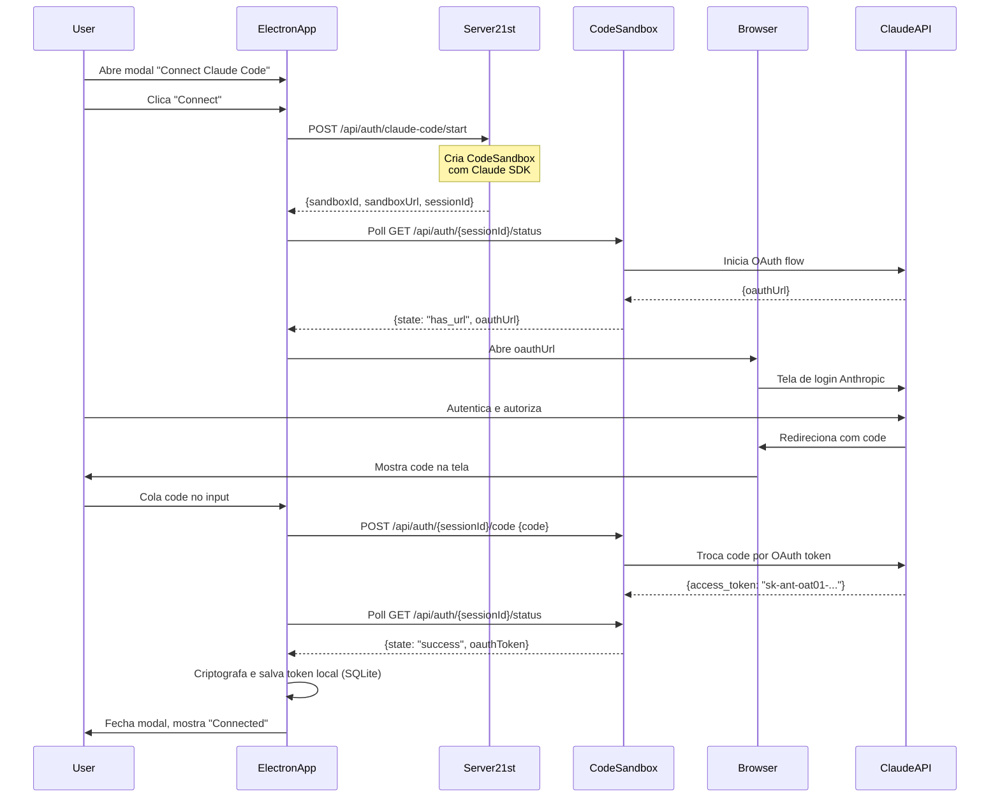

# Documentação Completa: Fluxos de Autenticação no Electron App

Esta documentação detalha os dois fluxos de autenticação implementados no app Electron "21st Agents", incluindo arquitetura, implementação, UI/UX e testes.

## Índice

1. [Visão Geral](#visão-geral)
2. [Fluxo 1: Desktop Authentication (21st.dev)](#fluxo-1-desktop-authentication-21stdev)
3. [Fluxo 2: Claude Code OAuth (via Subscription)](#fluxo-2-claude-code-oauth-via-subscription)
4. [Implementação Técnica](#implementação-técnica)
5. [Testes](#testes)
6. [Replicação em Outros Projetos](#replicação-em-outros-projetos)

---

## Visão Geral

O aplicativo implementa **dois fluxos de autenticação independentes**:

### 1. **Desktop Authentication (21st.dev)**
- Autentica o usuário do app com a plataforma 21st.dev
- Usa OAuth via deep linking (`twentyfirst-agents://`)
- Token armazenado localmente com criptografia OS (Keychain/DPAPI)
- Permite acesso às APIs do servidor 21st.dev

### 2. **Claude Code OAuth (Subscription)**
- Autentica com Claude Code via subscription do Anthropic
- Usa CodeSandbox temporário como proxy OAuth
- Token OAuth armazenado localmente (SQLite + safeStorage)
- Permite executar Claude Code SDK no app

**Arquitetura de Segurança:**
- Tokens criptografados com `electron.safeStorage` (OS Keychain)
- Nenhum token é enviado ao servidor 21st.dev
- Tokens Claude Code ficam apenas local
- Auto-refresh para desktop tokens

---

## Fluxo 1: Desktop Authentication (21st.dev)

### Diagrama do Fluxo



### Implementação

#### 1. Backend (Main Process)

##### `src/main/auth-store.ts` - Armazenamento Seguro

```typescript
import { safeStorage } from "electron"

export class AuthStore {
  private filePath: string // ~/Library/Application Support/Agents/auth.dat

  save(data: AuthData): void {
    const jsonData = JSON.stringify(data)

    if (safeStorage.isEncryptionAvailable()) {
      // Criptografa com OS Keychain (macOS), DPAPI (Windows), Secret Service (Linux)
      const encrypted = safeStorage.encryptString(jsonData)
      writeFileSync(this.filePath, encrypted)
    } else {
      // Fallback: avisa que não está criptografado
      writeFileSync(this.filePath + ".json", jsonData)
    }
  }

  load(): AuthData | null {
    if (existsSync(this.filePath) && safeStorage.isEncryptionAvailable()) {
      const encrypted = readFileSync(this.filePath)
      const decrypted = safeStorage.decryptString(encrypted)
      return JSON.parse(decrypted)
    }
    // ... fallback para arquivo .json não criptografado
  }
}
```

**Características:**
- Usa `safeStorage` do Electron (integração nativa com OS)
- Migração automática de tokens antigos não criptografados
- Fallback gracioso se criptografia não disponível

##### `src/main/auth-manager.ts` - Gerenciamento de Auth

```typescript
export class AuthManager {
  private store: AuthStore
  private refreshTimer?: NodeJS.Timeout

  async exchangeCode(code: string): Promise<AuthData> {
    // 1. Troca code por tokens no servidor
    const response = await fetch(`${API_URL}/api/auth/desktop/exchange`, {
      method: "POST",
      headers: { "Content-Type": "application/json" },
      body: JSON.stringify({
        code,
        deviceInfo: this.getDeviceInfo(), // "21st Desktop 0.0.3 (darwin arm64)"
      }),
    })

    const data = await response.json()
    const authData = {
      token: data.token,
      refreshToken: data.refreshToken,
      expiresAt: data.expiresAt,
      user: data.user,
    }

    // 2. Salva localmente (criptografado)
    this.store.save(authData)

    // 3. Agenda refresh automático
    this.scheduleRefresh()

    return authData
  }

  private scheduleRefresh(): void {
    const authData = this.store.load()
    if (!authData) return

    const expiresAt = new Date(authData.expiresAt).getTime()
    const now = Date.now()

    // Refresh 5 minutos antes de expirar
    const refreshIn = Math.max(0, expiresAt - now - 5 * 60 * 1000)

    this.refreshTimer = setTimeout(() => {
      this.refresh()
    }, refreshIn)
  }

  async refresh(): Promise<boolean> {
    const refreshToken = this.store.getRefreshToken()

    const response = await fetch(`${API_URL}/api/auth/desktop/refresh`, {
      method: "POST",
      body: JSON.stringify({ refreshToken }),
    })

    if (!response.ok) {
      if (response.status === 401) {
        this.logout() // Token inválido, requer re-login
      }
      return false
    }

    const data = await response.json()
    this.store.save(data)
    this.scheduleRefresh()

    // Notifica callback (para atualizar cookies)
    if (this.onTokenRefresh) {
      this.onTokenRefresh(data)
    }

    return true
  }
}
```

**Características:**
- Auto-refresh 5 minutos antes da expiração
- Callback para atualizar cookies quando token refresh
- Logout automático em caso de token inválido

##### `src/main/index.ts` - Deep Link Protocol

```typescript
// Protocolo: twentyfirst-agents:// (prod) ou twentyfirst-agents-dev:// (dev)
const PROTOCOL = IS_DEV ? "twentyfirst-agents-dev" : "twentyfirst-agents"

// Registra protocolo ANTES do app.whenReady()
function registerProtocol(): boolean {
  if (process.defaultApp) {
    // Dev mode: precisa passar execPath e script path
    return app.setAsDefaultProtocolClient(PROTOCOL, process.execPath, [
      process.argv[1]!,
    ])
  } else {
    // Production
    return app.setAsDefaultProtocolClient(PROTOCOL)
  }
}

// Handler do deep link
function handleDeepLink(url: string): void {
  // url = "twentyfirst-agents://auth?code=xxx"
  const parsed = new URL(url)

  if (parsed.pathname === "/auth" || parsed.host === "auth") {
    const code = parsed.searchParams.get("code")
    if (code) {
      handleAuthCode(code)
    }
  }
}

// macOS: app já rodando
app.on("open-url", (event, url) => {
  event.preventDefault()
  handleDeepLink(url)
})

// Windows/Linux: segunda instância
app.on("second-instance", (_event, commandLine) => {
  const url = commandLine.find((arg) => arg.startsWith(`${PROTOCOL}://`))
  if (url) {
    handleDeepLink(url)
  }
})
```

**Características:**
- Protocolo customizado registrado no OS
- Funciona diferente em cada plataforma (macOS vs Windows/Linux)
- Dev mode usa protocolo separado para evitar conflitos

##### Dev Mode: HTTP Callback Server

```typescript
// Dev: servidor HTTP local em http://localhost:21321
if (process.env.ELECTRON_RENDERER_URL) {
  const server = createServer((req, res) => {
    const url = new URL(req.url || "", "http://localhost:21321")

    if (url.pathname === "/auth/callback") {
      const code = url.searchParams.get("code")

      if (code) {
        handleAuthCode(code)

        // Mostra página de sucesso e fecha tab automaticamente
        res.writeHead(200, { "Content-Type": "text/html" })
        res.end(`
          <!DOCTYPE html>
          <html>
            <head><title>Authentication successful</title></head>
            <body>
              <h1>Authentication successful</h1>
              <p>You can close this tab</p>
              <script>setTimeout(() => window.close(), 1000)</script>
            </body>
          </html>
        `)
      }
    }
  })

  server.listen(21321)
}
```

**Por que HTTP em dev?**
- Deep linking pode não funcionar em primeira execução (macOS Launch Services)
- HTTP callback é mais confiável para desenvolvimento
- Servidor local evita necessidade de registrar protocolo toda vez

#### 2. UI/UX (Renderer Process)

##### `src/renderer/login.html` - Página de Login

```html
<!DOCTYPE html>
<html>
  <head>
    <title>21st - Login</title>
  </head>
  <body>
    <div class="container">
      <svg class="logo"><!-- Logo SVG --></svg>
      <button id="loginBtn">Sign in</button>
    </div>

    <script>
      // Listen para sucesso via IPC
      window.desktopApi.onAuthSuccess(function(user) {
        console.log('Auth success:', user?.email)
        // Window será recarregado pelo main process
      })

      // Ao clicar, inicia fluxo OAuth
      document.getElementById('loginBtn').addEventListener('click', function() {
        window.desktopApi.startAuthFlow()
      })
    </script>
  </body>
</html>
```

##### `src/main/windows/main.ts` - IPC Handlers

```typescript
// IPC handlers para auth
ipcMain.handle("auth:get-user", (event) => {
  if (!validateSender(event)) return null
  return getAuthManager().getUser()
})

ipcMain.handle("auth:start-flow", (event) => {
  if (!validateSender(event)) return
  getAuthManager().startAuthFlow(getWindow())
})

ipcMain.handle("auth:logout", async (event) => {
  if (!validateSender(event)) return
  getAuthManager().logout()

  // Limpa cookie
  const ses = session.fromPartition("persist:main")
  await ses.cookies.remove(getBaseUrl(), "x-desktop-token")

  showLoginPage()
})
```

**Segurança IPC:**
- `validateSender()` valida que requisição vem de domínio confiável
- Previne injection de código malicioso via webview

##### Cookie Sync

```typescript
// Após auth success, seta cookie para webview
const ses = session.fromPartition("persist:main")

await ses.cookies.set({
  url: getBaseUrl(),
  name: "x-desktop-token",
  value: authData.token,
  expirationDate: Math.floor(new Date(authData.expiresAt).getTime() / 1000),
  httpOnly: false,
  secure: getBaseUrl().startsWith("https"),
  sameSite: "lax",
})
```

**Por que cookie?**
- Permite webview carregar conteúdo do servidor já autenticado
- Cookie é atualizado automaticamente no token refresh

---

## Fluxo 2: Claude Code OAuth (via Subscription)

### Diagrama do Fluxo



### Implementação

#### 1. Backend (Main Process)

##### `src/main/lib/db/schema/index.ts` - Schema do Banco

```typescript
export const claudeCodeCredentials = sqliteTable("claude_code_credentials", {
  id: text("id").primaryKey().default("default"), // Sempre "default" (1 registro)
  oauthToken: text("oauth_token").notNull(), // Criptografado com safeStorage
  connectedAt: integer("connected_at", { mode: "timestamp" }),
  userId: text("user_id"), // Ref ao usuário desktop (opcional)
})
```

**Design:**
- Tabela de único registro (id sempre "default")
- Token criptografado com `safeStorage`
- SQLite em `{userData}/data/agents.db`

##### `src/main/lib/trpc/routers/claude-code.ts` - Router tRPC

```typescript
export const claudeCodeRouter = router({
  // 1. Inicia OAuth flow
  startAuth: publicProcedure.mutation(async () => {
    const token = await getDesktopToken() // Token desktop para auth com servidor
    if (!token) throw new Error("Not authenticated with 21st.dev")

    // Servidor cria sandbox (tem SDK do CodeSandbox)
    const response = await fetch(`${API_URL}/api/auth/claude-code/start`, {
      method: "POST",
      headers: { "x-desktop-token": token },
    })

    return await response.json() // {sandboxId, sandboxUrl, sessionId}
  }),

  // 2. Poll status do sandbox (busca OAuth URL)
  pollStatus: publicProcedure
    .input(z.object({
      sandboxUrl: z.string(),
      sessionId: z.string(),
    }))
    .query(async ({ input }) => {
      const response = await fetch(
        `${input.sandboxUrl}/api/auth/${input.sessionId}/status`
      )

      const data = await response.json()
      return {
        state: data.state, // "waiting" | "has_url" | "success" | "error"
        oauthUrl: data.oauthUrl ?? null,
        error: data.error ?? null,
      }
    }),

  // 3. Submete código OAuth
  submitCode: publicProcedure
    .input(z.object({
      sandboxUrl: z.string(),
      sessionId: z.string(),
      code: z.string(),
    }))
    .mutation(async ({ input }) => {
      // Envia code para sandbox
      await fetch(`${input.sandboxUrl}/api/auth/${input.sessionId}/code`, {
        method: "POST",
        body: JSON.stringify({ code: input.code }),
      })

      // Poll até obter token (max 10 segundos)
      let oauthToken: string | null = null

      for (let i = 0; i < 10; i++) {
        await new Promise((r) => setTimeout(r, 1000))

        const statusRes = await fetch(
          `${input.sandboxUrl}/api/auth/${input.sessionId}/status`
        )
        const status = await statusRes.json()

        if (status.state === "success" && status.oauthToken) {
          oauthToken = status.oauthToken
          break
        }

        if (status.state === "error") {
          throw new Error(status.error || "Authentication failed")
        }
      }

      if (!oauthToken) throw new Error("Timeout waiting for OAuth token")

      // Valida formato do token
      if (!oauthToken.startsWith("sk-ant-oat01-")) {
        throw new Error("Invalid OAuth token format")
      }

      // Criptografa e salva local
      const encryptedToken = encryptToken(oauthToken)
      const db = getDatabase()

      db.delete(claudeCodeCredentials)
        .where(eq(claudeCodeCredentials.id, "default"))
        .run()

      db.insert(claudeCodeCredentials)
        .values({
          id: "default",
          oauthToken: encryptedToken,
          connectedAt: new Date(),
          userId: getAuthManager().getUser()?.id,
        })
        .run()

      return { success: true }
    }),

  // 4. Obtém token descriptografado (para uso local)
  getToken: publicProcedure.query(() => {
    const db = getDatabase()
    const cred = db
      .select()
      .from(claudeCodeCredentials)
      .where(eq(claudeCodeCredentials.id, "default"))
      .get()

    if (!cred?.oauthToken) {
      return { token: null, error: "Not connected" }
    }

    try {
      const token = decryptToken(cred.oauthToken)
      return { token, error: null }
    } catch (error) {
      return { token: null, error: "Failed to decrypt token" }
    }
  }),

  // 5. Desconecta (apaga token local)
  disconnect: publicProcedure.mutation(() => {
    const db = getDatabase()
    db.delete(claudeCodeCredentials)
      .where(eq(claudeCodeCredentials.id, "default"))
      .run()
    return { success: true }
  }),
})
```

**Helpers de Criptografia:**

```typescript
function encryptToken(token: string): string {
  if (!safeStorage.isEncryptionAvailable()) {
    console.warn("Encryption not available, using base64")
    return Buffer.from(token).toString("base64")
  }
  return safeStorage.encryptString(token).toString("base64")
}

function decryptToken(encrypted: string): string {
  if (!safeStorage.isEncryptionAvailable()) {
    return Buffer.from(encrypted, "base64").toString("utf-8")
  }
  const buffer = Buffer.from(encrypted, "base64")
  return safeStorage.decryptString(buffer)
}
```

#### 2. UI/UX (Renderer Process)

##### `src/renderer/components/dialogs/claude-login-modal.tsx` - Modal de Login

```typescript
type AuthFlowState =
  | { step: "idle" }
  | { step: "starting" }
  | { step: "waiting_url"; sandboxId: string; sandboxUrl: string; sessionId: string }
  | { step: "has_url"; sandboxId: string; oauthUrl: string; sandboxUrl: string; sessionId: string }
  | { step: "submitting" }
  | { step: "error"; message: string }

export function ClaudeLoginModal() {
  const [flowState, setFlowState] = useState<AuthFlowState>({ step: "idle" })
  const [authCode, setAuthCode] = useState("")
  const [userClickedConnect, setUserClickedConnect] = useState(false)

  // tRPC mutations
  const startAuthMutation = trpc.claudeCode.startAuth.useMutation()
  const submitCodeMutation = trpc.claudeCode.submitCode.useMutation()
  const openOAuthUrlMutation = trpc.claudeCode.openOAuthUrl.useMutation()

  // Poll para OAuth URL
  const pollStatusQuery = trpc.claudeCode.pollStatus.useQuery(
    {
      sandboxUrl: flowState.step === "waiting_url" ? flowState.sandboxUrl : "",
      sessionId: flowState.step === "waiting_url" ? flowState.sessionId : "",
    },
    {
      enabled: flowState.step === "waiting_url",
      refetchInterval: 1500, // Poll a cada 1.5s
    }
  )

  // Atualiza state quando OAuth URL chega
  useEffect(() => {
    if (flowState.step === "waiting_url" && pollStatusQuery.data?.oauthUrl) {
      setFlowState({
        step: "has_url",
        sandboxId: flowState.sandboxId,
        oauthUrl: pollStatusQuery.data.oauthUrl,
        sandboxUrl: flowState.sandboxUrl,
        sessionId: flowState.sessionId,
      })
    }
  }, [pollStatusQuery.data, flowState])

  // Abre URL no browser quando pronto
  useEffect(() => {
    if (flowState.step === "has_url" && userClickedConnect && !urlOpenedRef.current) {
      urlOpenedRef.current = true
      setUrlOpened(true)
      openOAuthUrlMutation.mutate(flowState.oauthUrl)
    }
  }, [flowState, userClickedConnect])

  const handleConnectClick = async () => {
    setUserClickedConnect(true)
    setFlowState({ step: "starting" })

    try {
      const result = await startAuthMutation.mutateAsync()
      setFlowState({
        step: "waiting_url",
        sandboxId: result.sandboxId,
        sandboxUrl: result.sandboxUrl,
        sessionId: result.sessionId,
      })
    } catch (err) {
      setFlowState({
        step: "error",
        message: err instanceof Error ? err.message : "Failed to start",
      })
    }
  }

  const handleCodeChange = (e: React.ChangeEvent<HTMLInputElement>) => {
    const value = e.target.value
    setAuthCode(value)

    // Auto-submit se código válido (XXX#YYY, > 50 chars)
    if (isValidCodeFormat(value) && flowState.step === "has_url") {
      setTimeout(async () => {
        setFlowState({ step: "submitting" })

        try {
          await submitCodeMutation.mutateAsync({
            sandboxUrl: flowState.sandboxUrl,
            sessionId: flowState.sessionId,
            code: value.trim(),
          })

          setOpen(false) // Fecha modal
        } catch (err) {
          setFlowState({
            step: "error",
            message: err instanceof Error ? err.message : "Failed to submit",
          })
        }
      }, 100)
    }
  }

  return (
    <AlertDialog open={open} onOpenChange={setOpen}>
      <AlertDialogContent>
        <div className="space-y-8">
          {/* Header com ícones */}
          <div className="text-center">
            <div className="flex gap-2">
              <Logo />
              <ClaudeCodeIcon />
            </div>
            <h1>Claude Code</h1>
            <p>Connect your Claude Code subscription</p>
          </div>

          {/* Botão Connect */}
          {!urlOpened && flowState.step !== "has_url" && (
            <Button
              onClick={handleConnectClick}
              disabled={userClickedConnect && isLoadingAuth}
            >
              {userClickedConnect && isLoadingAuth ? <Spinner /> : "Connect"}
            </Button>
          )}

          {/* Input de código */}
          {urlOpened && (
            <div>
              <Input
                value={authCode}
                onChange={handleCodeChange}
                placeholder="Paste your authentication code here..."
                className="font-mono text-center"
                autoFocus
                disabled={isSubmitting}
              />
              <Button
                onClick={handleSubmitCode}
                disabled={!authCode.trim() || isSubmitting}
              >
                {isSubmitting ? <Spinner /> : "Continue"}
              </Button>
              <p className="text-xs text-muted-foreground">
                A new tab has opened for authentication.
                <button onClick={handleOpenFallbackUrl}>
                  Didn't open? Click here
                </button>
              </p>
            </div>
          )}

          {/* Estado de erro */}
          {flowState.step === "error" && (
            <div>
              <div className="p-4 bg-destructive/10">
                <p>{flowState.message}</p>
              </div>
              <Button onClick={handleConnectClick}>Try Again</Button>
            </div>
          )}
        </div>
      </AlertDialogContent>
    </AlertDialog>
  )
}
```

**Fluxo da UI:**

1. **Idle → Starting:**
   - Usuário clica "Connect"
   - Mostra spinner no botão
   - Chama `startAuth` via tRPC

2. **Starting → Waiting URL:**
   - Recebe `{sandboxId, sandboxUrl, sessionId}`
   - Inicia polling de status (1.5s interval)

3. **Waiting URL → Has URL:**
   - Poll retorna `{oauthUrl}`
   - Abre URL no browser automaticamente
   - Mostra input de código

4. **Has URL → Submitting:**
   - Usuário cola código
   - Auto-submit se formato válido
   - Envia código para sandbox

5. **Submitting → Success:**
   - Poll até receber token
   - Salva localmente
   - Fecha modal

**UX Highlights:**
- Spinner apenas após usuário clicar (não mostra loading antes)
- Auto-submit no paste (detecta formato do código)
- Fallback "Didn't open?" para reabrir URL
- Polling automático transparente

---

## Implementação Técnica

### Arquitetura de Segurança

#### 1. Criptografia com `safeStorage`

O Electron fornece API nativa de criptografia que usa:

| OS | Tecnologia |
|----|-----------|
| macOS | Keychain |
| Windows | DPAPI (Data Protection API) |
| Linux | Secret Service API |

**Implementação:**

```typescript
import { safeStorage } from "electron"

// Verifica disponibilidade (sempre true após app.ready)
if (safeStorage.isEncryptionAvailable()) {
  // Criptografa string
  const encrypted: Buffer = safeStorage.encryptString("sensitive data")

  // Descriptografa
  const decrypted: string = safeStorage.decryptString(encrypted)
}
```

**Características:**
- Chaves gerenciadas pelo OS (não ficam no app)
- Usuário pode precisar desbloquear Keychain/DPAPI
- Migração automática de tokens antigos

#### 2. tRPC Type-Safe IPC

Usa `trpc-electron` para comunicação type-safe entre main↔renderer:

**Main Process:**
```typescript
import { createIPCHandler } from "trpc-electron/main"

const ipcHandler = createIPCHandler({
  router: createAppRouter(getWindow),
  windows: [window],
  createContext: async () => ({
    getWindow,
  }),
})
```

**Renderer Process:**
```typescript
import { createTRPCProxyClient } from "@trpc/client"
import { ipcLink } from "trpc-electron/renderer"

const trpc = createTRPCProxyClient<AppRouter>({
  links: [ipcLink()],
})

// Type-safe call
const result = await trpc.claudeCode.startAuth.mutate()
```

**Benefícios:**
- Type-safety completo (TypeScript)
- Sem magic strings para IPC channels
- Validação automática com Zod
- Streaming support (subscriptions)

#### 3. Deep Link Protocol Registration

**macOS:**
```xml
<!-- Info.plist -->
<key>CFBundleURLTypes</key>
<array>
  <dict>
    <key>CFBundleURLName</key>
    <string>dev.21st.agents</string>
    <key>CFBundleURLSchemes</key>
    <array>
      <string>twentyfirst-agents</string>
    </array>
  </dict>
</array>
```

**Electron Builder Config:**
```json
{
  "mac": {
    "protocols": [
      {
        "name": "21st Agents",
        "schemes": ["twentyfirst-agents"]
      }
    ]
  }
}
```

**Runtime Registration:**
```typescript
// Sempre registrar em app.whenReady()
app.whenReady().then(() => {
  if (process.defaultApp) {
    // Dev: precisa de execPath e script path
    app.setAsDefaultProtocolClient(PROTOCOL, process.execPath, [
      process.argv[1]!,
    ])
  } else {
    // Prod
    app.setAsDefaultProtocolClient(PROTOCOL)
  }

  // Handler
  app.on("open-url", (event, url) => {
    event.preventDefault()
    handleDeepLink(url)
  })
})
```

**Debugging First Install:**
```typescript
// Verificar se OS reconhece o protocolo
const isDefault = app.isDefaultProtocolClient(PROTOCOL)
console.log("Is default protocol client:", isDefault)

// macOS pode levar alguns segundos após instalação
// Launch Services precisa atualizar cache
```

#### 4. Session Partitions & Cookies

```typescript
import { session } from "electron"

// Usa partition persistente para manter cookies entre sessões
const ses = session.fromPartition("persist:main")

// Seta cookie de auth
await ses.cookies.set({
  url: "https://21st.dev",
  name: "x-desktop-token",
  value: token,
  expirationDate: Math.floor(expiresAt / 1000),
  httpOnly: false, // JS precisa acessar
  secure: true,
  sameSite: "lax",
})

// Remove cookie
await ses.cookies.remove("https://21st.dev", "x-desktop-token")
```

**Por que cookies?**
- WebView pode carregar conteúdo autenticado do servidor
- Cookies são enviados automaticamente em requests
- Sincronizado com token local no refresh

### Database (Drizzle ORM + SQLite)

**Localização:**
```
macOS: ~/Library/Application Support/Agents/data/agents.db
Windows: %APPDATA%/Agents/data/agents.db
Linux: ~/.config/Agents/data/agents.db
```

**Schema:**
```typescript
// Claude Code credentials (single row)
export const claudeCodeCredentials = sqliteTable("claude_code_credentials", {
  id: text("id").primaryKey().default("default"),
  oauthToken: text("oauth_token").notNull(), // Encrypted
  connectedAt: integer("connected_at", { mode: "timestamp" }),
  userId: text("user_id"), // Desktop user ref
})
```

**Migrations:**
```typescript
import { drizzle } from "drizzle-orm/better-sqlite3"
import { migrate } from "drizzle-orm/better-sqlite3/migrator"
import Database from "better-sqlite3"

export function initDatabase() {
  const dbPath = join(app.getPath("userData"), "data/agents.db")
  const sqlite = new Database(dbPath)
  const db = drizzle(sqlite)

  // Auto-migrate on app start
  const migrationsFolder = app.isPackaged
    ? join(process.resourcesPath, "migrations")
    : join(app.getAppPath(), "drizzle")

  migrate(db, { migrationsFolder })

  return db
}
```

**Características:**
- Auto-migration em startup (sem intervenção manual)
- Migrations no bundle (resources/migrations/)
- WAL mode para performance
- Single connection (Electron main process)

---

## Testes

### 1. Unit Tests (Backend)

#### `tests/auth-store.test.ts`

```typescript
import { AuthStore } from "../src/main/auth-store"
import { safeStorage } from "electron"
import { mkdtempSync, rmSync } from "fs"
import { join } from "path"

describe("AuthStore", () => {
  let tempDir: string
  let store: AuthStore

  beforeEach(() => {
    tempDir = mkdtempSync(join(require("os").tmpdir(), "auth-test-"))
    store = new AuthStore(tempDir)
  })

  afterEach(() => {
    rmSync(tempDir, { recursive: true, force: true })
  })

  it("should save and load encrypted auth data", () => {
    const authData = {
      token: "test-token",
      refreshToken: "test-refresh",
      expiresAt: new Date(Date.now() + 3600000).toISOString(),
      user: {
        id: "user123",
        email: "test@example.com",
        name: "Test User",
        imageUrl: null,
        username: null,
      },
    }

    store.save(authData)
    const loaded = store.load()

    expect(loaded).toEqual(authData)
  })

  it("should return null when no auth data exists", () => {
    const loaded = store.load()
    expect(loaded).toBeNull()
  })

  it("should detect authentication status", () => {
    expect(store.isAuthenticated()).toBe(false)

    const authData = {
      token: "test-token",
      refreshToken: "test-refresh",
      expiresAt: new Date(Date.now() + 3600000).toISOString(),
      user: {
        id: "user123",
        email: "test@example.com",
        name: null,
        imageUrl: null,
        username: null,
      },
    }

    store.save(authData)
    expect(store.isAuthenticated()).toBe(true)
  })

  it("should return false when token is expired", () => {
    const authData = {
      token: "test-token",
      refreshToken: "test-refresh",
      expiresAt: new Date(Date.now() - 1000).toISOString(), // Expired
      user: {
        id: "user123",
        email: "test@example.com",
        name: null,
        imageUrl: null,
        username: null,
      },
    }

    store.save(authData)
    expect(store.isAuthenticated()).toBe(false)
  })

  it("should detect when token needs refresh", () => {
    const authData = {
      token: "test-token",
      refreshToken: "test-refresh",
      expiresAt: new Date(Date.now() + 3 * 60 * 1000).toISOString(), // 3 min
      user: {
        id: "user123",
        email: "test@example.com",
        name: null,
        imageUrl: null,
        username: null,
      },
    }

    store.save(authData)
    expect(store.needsRefresh()).toBe(true) // Needs refresh < 5 min
  })

  it("should clear all auth data", () => {
    const authData = {
      token: "test-token",
      refreshToken: "test-refresh",
      expiresAt: new Date(Date.now() + 3600000).toISOString(),
      user: {
        id: "user123",
        email: "test@example.com",
        name: null,
        imageUrl: null,
        username: null,
      },
    }

    store.save(authData)
    store.clear()

    expect(store.load()).toBeNull()
    expect(store.isAuthenticated()).toBe(false)
  })

  it("should migrate plaintext auth to encrypted", () => {
    // Mock encryption not available initially
    const originalIsAvailable = safeStorage.isEncryptionAvailable
    safeStorage.isEncryptionAvailable = () => false

    const authData = {
      token: "test-token",
      refreshToken: "test-refresh",
      expiresAt: new Date(Date.now() + 3600000).toISOString(),
      user: {
        id: "user123",
        email: "test@example.com",
        name: null,
        imageUrl: null,
        username: null,
      },
    }

    store.save(authData)

    // Now encryption available
    safeStorage.isEncryptionAvailable = originalIsAvailable

    const loaded = store.load() // Should auto-migrate

    expect(loaded).toEqual(authData)

    // Cleanup
    safeStorage.isEncryptionAvailable = originalIsAvailable
  })
})
```

#### `tests/auth-manager.test.ts`

```typescript
import { AuthManager } from "../src/main/auth-manager"
import { AuthStore } from "../src/main/auth-store"
import { jest } from "@jest/globals"

// Mock fetch
global.fetch = jest.fn()

describe("AuthManager", () => {
  let manager: AuthManager
  let mockStore: jest.Mocked<AuthStore>

  beforeEach(() => {
    mockStore = {
      save: jest.fn(),
      load: jest.fn(),
      clear: jest.fn(),
      isAuthenticated: jest.fn(),
      getUser: jest.fn(),
      getToken: jest.fn(),
      getRefreshToken: jest.fn(),
      needsRefresh: jest.fn(),
      updateUser: jest.fn(),
    } as any

    manager = new AuthManager(false)
    ;(manager as any).store = mockStore
  })

  afterEach(() => {
    jest.clearAllMocks()
  })

  it("should exchange code for tokens", async () => {
    const mockResponse = {
      token: "access-token",
      refreshToken: "refresh-token",
      expiresAt: new Date(Date.now() + 3600000).toISOString(),
      user: {
        id: "user123",
        email: "test@example.com",
        name: "Test",
        imageUrl: null,
        username: null,
      },
    }

    ;(global.fetch as jest.Mock).mockResolvedValueOnce({
      ok: true,
      json: async () => mockResponse,
    })

    const result = await manager.exchangeCode("test-code")

    expect(fetch).toHaveBeenCalledWith(
      expect.stringContaining("/api/auth/desktop/exchange"),
      expect.objectContaining({
        method: "POST",
        body: expect.stringContaining("test-code"),
      })
    )

    expect(mockStore.save).toHaveBeenCalledWith(mockResponse)
    expect(result).toEqual(mockResponse)
  })

  it("should throw error on exchange failure", async () => {
    ;(global.fetch as jest.Mock).mockResolvedValueOnce({
      ok: false,
      status: 401,
      json: async () => ({ error: "Invalid code" }),
    })

    await expect(manager.exchangeCode("bad-code")).rejects.toThrow("Invalid code")
  })

  it("should refresh token successfully", async () => {
    const mockResponse = {
      token: "new-access-token",
      refreshToken: "new-refresh-token",
      expiresAt: new Date(Date.now() + 3600000).toISOString(),
      user: {
        id: "user123",
        email: "test@example.com",
        name: "Test",
        imageUrl: null,
        username: null,
      },
    }

    mockStore.getRefreshToken.mockReturnValue("old-refresh-token")
    ;(global.fetch as jest.Mock).mockResolvedValueOnce({
      ok: true,
      json: async () => mockResponse,
    })

    const result = await manager.refresh()

    expect(result).toBe(true)
    expect(mockStore.save).toHaveBeenCalledWith(mockResponse)
  })

  it("should logout on 401 refresh error", async () => {
    mockStore.getRefreshToken.mockReturnValue("expired-refresh-token")
    ;(global.fetch as jest.Mock).mockResolvedValueOnce({
      ok: false,
      status: 401,
    })

    const result = await manager.refresh()

    expect(result).toBe(false)
    expect(mockStore.clear).toHaveBeenCalled()
  })

  it("should schedule refresh before expiration", () => {
    jest.useFakeTimers()

    const authData = {
      token: "test-token",
      refreshToken: "test-refresh",
      expiresAt: new Date(Date.now() + 10 * 60 * 1000).toISOString(), // 10 min
      user: {
        id: "user123",
        email: "test@example.com",
        name: null,
        imageUrl: null,
        username: null,
      },
    }

    mockStore.load.mockReturnValue(authData)
    mockStore.getRefreshToken.mockReturnValue("test-refresh")

    ;(manager as any).scheduleRefresh()

    // Should schedule refresh 5 minutes before expiration (5 min from now)
    expect(setTimeout).toHaveBeenCalledWith(
      expect.any(Function),
      5 * 60 * 1000
    )

    jest.useRealTimers()
  })
})
```

#### `tests/claude-code-router.test.ts`

```typescript
import { claudeCodeRouter } from "../src/main/lib/trpc/routers/claude-code"
import { getDatabase } from "../src/main/lib/db"
import { safeStorage } from "electron"
import { jest } from "@jest/globals"

// Mock dependencies
jest.mock("../src/main/lib/db")
jest.mock("../src/main/index")
jest.mock("electron", () => ({
  safeStorage: {
    isEncryptionAvailable: jest.fn(() => true),
    encryptString: jest.fn((str) => Buffer.from(str)),
    decryptString: jest.fn((buf) => buf.toString()),
  },
  shell: {
    openExternal: jest.fn(),
  },
}))

global.fetch = jest.fn()

describe("claudeCodeRouter", () => {
  let mockDb: any

  beforeEach(() => {
    mockDb = {
      select: jest.fn(() => ({
        from: jest.fn(() => ({
          where: jest.fn(() => ({
            get: jest.fn(() => null),
          })),
        })),
      })),
      insert: jest.fn(() => ({
        values: jest.fn(() => ({
          run: jest.fn(),
        })),
      })),
      delete: jest.fn(() => ({
        where: jest.fn(() => ({
          run: jest.fn(),
        })),
      })),
    }

    ;(getDatabase as jest.Mock).mockReturnValue(mockDb)
  })

  afterEach(() => {
    jest.clearAllMocks()
  })

  it("should start auth flow", async () => {
    const mockResponse = {
      sandboxId: "sandbox123",
      sandboxUrl: "https://sandbox.example.com",
      sessionId: "session123",
    }

    ;(global.fetch as jest.Mock).mockResolvedValueOnce({
      ok: true,
      json: async () => mockResponse,
    })

    // Mock getDesktopToken
    const { getAuthManager } = require("../src/main/index")
    getAuthManager.mockReturnValue({
      getValidToken: async () => "desktop-token",
    })

    const caller = claudeCodeRouter.createCaller({})
    const result = await caller.startAuth()

    expect(result).toEqual(mockResponse)
    expect(fetch).toHaveBeenCalledWith(
      expect.stringContaining("/api/auth/claude-code/start"),
      expect.objectContaining({
        method: "POST",
        headers: { "x-desktop-token": "desktop-token" },
      })
    )
  })

  it("should poll status", async () => {
    const mockStatus = {
      state: "has_url",
      oauthUrl: "https://claude.ai/oauth/...",
      error: null,
    }

    ;(global.fetch as jest.Mock).mockResolvedValueOnce({
      ok: true,
      json: async () => mockStatus,
    })

    const caller = claudeCodeRouter.createCaller({})
    const result = await caller.pollStatus({
      sandboxUrl: "https://sandbox.example.com",
      sessionId: "session123",
    })

    expect(result).toEqual(mockStatus)
  })

  it("should submit code and store token", async () => {
    const mockOAuthToken = "sk-ant-oat01-test-token"

    // Mock code submission
    ;(global.fetch as jest.Mock)
      .mockResolvedValueOnce({
        ok: true,
      })
      // Mock status polling (success after 2 tries)
      .mockResolvedValueOnce({
        ok: true,
        json: async () => ({ state: "processing", oauthToken: null }),
      })
      .mockResolvedValueOnce({
        ok: true,
        json: async () => ({ state: "success", oauthToken: mockOAuthToken }),
      })

    const caller = claudeCodeRouter.createCaller({})
    const result = await caller.submitCode({
      sandboxUrl: "https://sandbox.example.com",
      sessionId: "session123",
      code: "test-oauth-code",
    })

    expect(result.success).toBe(true)
    expect(mockDb.insert).toHaveBeenCalled()
  })

  it("should get stored token", async () => {
    const mockToken = "sk-ant-oat01-test-token"
    const encryptedToken = Buffer.from(mockToken).toString("base64")

    mockDb.select().from().where().get = jest.fn(() => ({
      id: "default",
      oauthToken: encryptedToken,
      connectedAt: new Date(),
      userId: "user123",
    }))

    const caller = claudeCodeRouter.createCaller({})
    const result = await caller.getToken()

    expect(result.token).toBe(mockToken)
    expect(result.error).toBeNull()
  })

  it("should disconnect and clear token", async () => {
    const caller = claudeCodeRouter.createCaller({})
    const result = await caller.disconnect()

    expect(result.success).toBe(true)
    expect(mockDb.delete).toHaveBeenCalled()
  })
})
```

### 2. Integration Tests (E2E)

#### `e2e/auth-flow.spec.ts` (Playwright)

```typescript
import { test, expect, _electron as electron } from "@playwright/test"
import { ElectronApplication, Page } from "playwright"

test.describe("Desktop Authentication Flow", () => {
  let app: ElectronApplication
  let window: Page

  test.beforeAll(async () => {
    app = await electron.launch({
      args: [".", "--dev"],
      env: {
        ...process.env,
        NODE_ENV: "test",
      },
    })

    window = await app.firstWindow()
  })

  test.afterAll(async () => {
    await app.close()
  })

  test("should show login page when not authenticated", async () => {
    await window.waitForSelector("text=Sign in")
    expect(await window.title()).toBe("21st - Login")
  })

  test("should start auth flow on button click", async () => {
    const button = await window.locator("button:has-text('Sign in')")

    // Mock shell.openExternal to capture URL
    const openedUrls: string[] = []
    await app.evaluate(({ shell }, urls) => {
      const original = shell.openExternal
      shell.openExternal = async (url: string) => {
        urls.push(url)
        return original(url)
      }
    }, openedUrls)

    await button.click()

    // Wait for URL to be opened
    await window.waitForTimeout(1000)

    expect(openedUrls.length).toBeGreaterThan(0)
    expect(openedUrls[0]).toContain("/auth/desktop")
  })

  test("should handle deep link callback", async () => {
    // Simulate deep link
    await app.evaluate(async ({ app }) => {
      const { handleAuthCode } = require("./src/main/index")
      await handleAuthCode("test-auth-code-12345")
    })

    // Should show app interface (not login page)
    await window.waitForSelector("[data-agents-page]")
    expect(await window.locator("text=Sign in").count()).toBe(0)
  })

  test("should persist auth across restarts", async () => {
    // Close and reopen app
    await app.close()

    app = await electron.launch({
      args: [".", "--dev"],
      env: {
        ...process.env,
        NODE_ENV: "test",
      },
    })

    window = await app.firstWindow()

    // Should go directly to app (not login page)
    await window.waitForSelector("[data-agents-page]")
    expect(await window.locator("text=Sign in").count()).toBe(0)
  })
})

test.describe("Claude Code OAuth Flow", () => {
  let app: ElectronApplication
  let window: Page

  test.beforeAll(async () => {
    app = await electron.launch({
      args: [".", "--dev"],
      env: {
        ...process.env,
        NODE_ENV: "test",
      },
    })

    window = await app.firstWindow()

    // Ensure authenticated with desktop first
    await app.evaluate(async () => {
      const { getAuthManager } = require("./src/main/index")
      const manager = getAuthManager()
      // Mock authenticated state
    })
  })

  test.afterAll(async () => {
    await app.close()
  })

  test("should open Claude Code modal", async () => {
    // Navigate to settings
    await window.click("button[aria-label='Settings']")
    await window.click("text=Claude Code")

    // Open modal
    await window.click("text=Connect")

    await window.waitForSelector("text=Connect your Claude Code subscription")
  })

  test("should start OAuth flow", async () => {
    await window.click("button:has-text('Connect')")

    // Should show loading state
    await window.waitForSelector("[data-testid='spinner']")

    // Wait for OAuth URL
    await window.waitForSelector("input[placeholder*='authentication code']", {
      timeout: 10000,
    })
  })

  test("should submit code and save token", async () => {
    // Paste code
    const input = await window.locator("input[placeholder*='authentication code']")
    await input.fill("mock-oauth-code-XXX#YYY")

    // Auto-submit should trigger
    await window.waitForTimeout(500)

    // Modal should close
    await expect(window.locator("text=Connect your Claude Code subscription")).not.toBeVisible()

    // Should show "Connected" status
    await window.waitForSelector("text=Connected")
  })

  test("should persist Claude Code token", async () => {
    // Check database
    const hasToken = await app.evaluate(async () => {
      const { getDatabase, claudeCodeCredentials } = require("./src/main/lib/db")
      const { eq } = require("drizzle-orm")

      const db = getDatabase()
      const cred = db
        .select()
        .from(claudeCodeCredentials)
        .where(eq(claudeCodeCredentials.id, "default"))
        .get()

      return !!cred?.oauthToken
    })

    expect(hasToken).toBe(true)
  })
})
```

### 3. Manual Testing Checklist

#### Desktop Auth Flow

**First Install:**
- [ ] App abre na tela de login (não logado)
- [ ] Botão "Sign in" funciona
- [ ] Browser abre com página de auth
- [ ] Deep link funciona após auth (app ativa)
- [ ] Token salvo e criptografado
- [ ] App mostra interface autenticada

**macOS First Install Issues:**
- [ ] Se deep link não funcionar na primeira vez:
  - [ ] Reabrir app manualmente
  - [ ] Clicar "Sign in" novamente
  - [ ] Deep link deve funcionar agora (Launch Services atualizado)

**Token Refresh:**
- [ ] Deixar app aberto por > 55 minutos
- [ ] Token deve refresh automaticamente
- [ ] Não perde sessão
- [ ] Cookie atualizado

**Logout:**
- [ ] Botão logout funciona
- [ ] Token apagado do disco
- [ ] Cookie removido
- [ ] Volta para tela de login

**Dev Mode:**
- [ ] HTTP callback em localhost:21321 funciona
- [ ] Página de sucesso aparece e fecha automaticamente
- [ ] Token salvo corretamente

#### Claude Code OAuth Flow

**Connection:**
- [ ] Modal abre ao clicar "Connect Claude Code"
- [ ] Botão "Connect" inicia fluxo
- [ ] Spinner aparece após clicar
- [ ] OAuth URL abre no browser (1-3 segundos)
- [ ] Input de código aparece

**OAuth Flow:**
- [ ] Browser mostra tela de login Anthropic
- [ ] Pode logar com email ou SSO
- [ ] Após auth, mostra código na tela
- [ ] Código pode ser copiado

**Code Submission:**
- [ ] Colar código no input
- [ ] Auto-submit funciona (sem clicar botão)
- [ ] Modal fecha após sucesso
- [ ] Status muda para "Connected"

**Token Storage:**
- [ ] Token salvo criptografado em DB
- [ ] Token pode ser lido novamente (descriptografado)
- [ ] Persiste entre reinicializações

**Disconnect:**
- [ ] Botão "Disconnect" funciona
- [ ] Token apagado do DB
- [ ] Status volta para "Not connected"

**Error Handling:**
- [ ] Erro de rede mostra mensagem clara
- [ ] Botão "Try Again" funciona
- [ ] Código inválido mostra erro
- [ ] Timeout após 10s mostra erro

---

## Replicação em Outros Projetos

### Setup Mínimo

#### 1. Dependências

```json
{
  "dependencies": {
    "electron": "^33.4.5",
    "@trpc/client": "^10.45.0",
    "@trpc/server": "^10.45.0",
    "trpc-electron": "^0.5.2",
    "drizzle-orm": "^0.36.4",
    "better-sqlite3": "^11.8.1",
    "zod": "^3.24.1"
  },
  "devDependencies": {
    "electron-builder": "^25.1.8",
    "drizzle-kit": "^0.29.1"
  }
}
```

#### 2. Estrutura de Arquivos

```
your-app/
├── src/
│   ├── main/
│   │   ├── index.ts              # Main entry
│   │   ├── auth-store.ts         # Token storage
│   │   ├── auth-manager.ts       # Auth logic
│   │   └── lib/
│   │       ├── db/
│   │       │   ├── index.ts      # DB init
│   │       │   └── schema.ts     # Tables
│   │       └── trpc/
│   │           └── routers/
│   │               └── auth.ts   # Auth router
│   ├── preload/
│   │   └── index.ts              # IPC bridge
│   └── renderer/
│       ├── login.html            # Login page
│       └── components/
│           └── auth-modal.tsx    # OAuth modal
├── drizzle/                      # Migrations
├── electron-builder.yml          # Builder config
└── package.json
```

#### 3. Electron Builder Config

```yaml
appId: com.yourcompany.yourapp
productName: YourApp

protocols:
  - name: YourApp
    schemes:
      - yourapp

mac:
  category: public.app-category.developer-tools
  hardenedRuntime: true
  gatekeeperAssess: false
  entitlements: build/entitlements.mac.plist
  entitlementsInherit: build/entitlements.mac.plist
  notarize: true

linux:
  target:
    - AppImage
    - deb
  category: Development
  mimeTypes:
    - x-scheme-handler/yourapp

win:
  target:
    - nsis
    - portable
```

#### 4. Package.json Scripts

```json
{
  "scripts": {
    "dev": "electron-vite dev",
    "build": "electron-vite build",
    "package": "electron-builder --dir",
    "package:mac": "electron-builder --mac",
    "package:win": "electron-builder --win",
    "package:linux": "electron-builder --linux",
    "db:generate": "drizzle-kit generate",
    "db:push": "drizzle-kit push"
  }
}
```

### Adaptações para Seu Projeto

#### Se seu servidor não suporta OAuth desktop:

**Opção 1: Deep Link com Token Direto**
```typescript
// Servidor redireciona com token no URL (menos seguro)
// yourapp://auth?token=xxx&refresh=yyy

// App extrai e salva
function handleDeepLink(url: string) {
  const parsed = new URL(url)
  const token = parsed.searchParams.get("token")
  const refreshToken = parsed.searchParams.get("refresh")

  if (token && refreshToken) {
    authManager.saveTokens({ token, refreshToken })
  }
}
```

**Opção 2: HTTP Callback Sempre (não deep link)**
```typescript
// Servidor redireciona para localhost
// http://localhost:PORT/auth/callback?token=xxx

const server = createServer((req, res) => {
  const url = new URL(req.url!, `http://localhost:${PORT}`)

  if (url.pathname === "/auth/callback") {
    const token = url.searchParams.get("token")
    // Salva token...
  }
})
```

#### Se não precisa de Claude Code OAuth:

Remova:
- `src/main/lib/trpc/routers/claude-code.ts`
- `claudeCodeCredentials` table do schema
- Modal de Claude Code do renderer

#### Se usa outro provedor OAuth (não Anthropic):

Adapte o fluxo:
1. Substitua CodeSandbox por seu próprio proxy ou servidor
2. Adapte validação de token (formato diferente)
3. Ajuste UI para refletir seu provedor

#### Se não precisa de criptografia local:

```typescript
// Versão simplificada sem safeStorage
class SimpleAuthStore {
  save(data: AuthData): void {
    const json = JSON.stringify(data)
    writeFileSync(this.filePath, json, "utf-8")
  }

  load(): AuthData | null {
    if (!existsSync(this.filePath)) return null
    const json = readFileSync(this.filePath, "utf-8")
    return JSON.parse(json)
  }
}
```

**⚠️ Não recomendado para produção!**

### Checklist de Implementação

**Backend (Main Process):**
- [ ] Implementar `AuthStore` com `safeStorage`
- [ ] Implementar `AuthManager` com auto-refresh
- [ ] Registrar deep link protocol
- [ ] Criar HTTP callback server (dev mode)
- [ ] Criar schema de banco para tokens
- [ ] Implementar routers tRPC

**Frontend (Renderer):**
- [ ] Criar página de login (`login.html`)
- [ ] Implementar modal de OAuth (se aplicável)
- [ ] Conectar com tRPC client
- [ ] Testar fluxo completo

**Build & Deploy:**
- [ ] Configurar `electron-builder`
- [ ] Testar build em cada plataforma
- [ ] Testar primeira instalação (deep link)
- [ ] Configurar code signing (macOS/Windows)

**Testes:**
- [ ] Unit tests para `AuthStore`
- [ ] Unit tests para `AuthManager`
- [ ] E2E tests com Playwright
- [ ] Manual testing checklist

---

## Conclusão

Este documento cobriu **dois fluxos de autenticação completos**:

1. **Desktop Auth (21st.dev):** OAuth via deep linking com token refresh automático
2. **Claude Code OAuth:** Subscription auth via sandbox proxy

**Principais Características:**

- ✅ Criptografia nativa (OS Keychain/DPAPI)
- ✅ Auto-refresh de tokens
- ✅ Type-safe com tRPC
- ✅ Cross-platform (macOS/Windows/Linux)
- ✅ Dev mode com HTTP callback
- ✅ Persistência segura (SQLite)
- ✅ E2E testável

**Para replicar em seu projeto:**

1. Copie as classes `AuthStore` e `AuthManager`
2. Adapte para sua API de backend
3. Configure deep link protocol
4. Implemente UI de login
5. Teste em todas as plataformas

**Recursos Adicionais:**

- [Electron safeStorage API](https://www.electronjs.org/docs/latest/api/safe-storage)
- [tRPC Electron Adapter](https://github.com/jsonnull/electron-trpc)
- [Drizzle ORM Docs](https://orm.drizzle.team)
- [Electron Builder](https://www.electron.build)

---

**Criado em:** 2026-01-20
**Versão do App:** 0.0.3
**Electron:** 33.4.5
